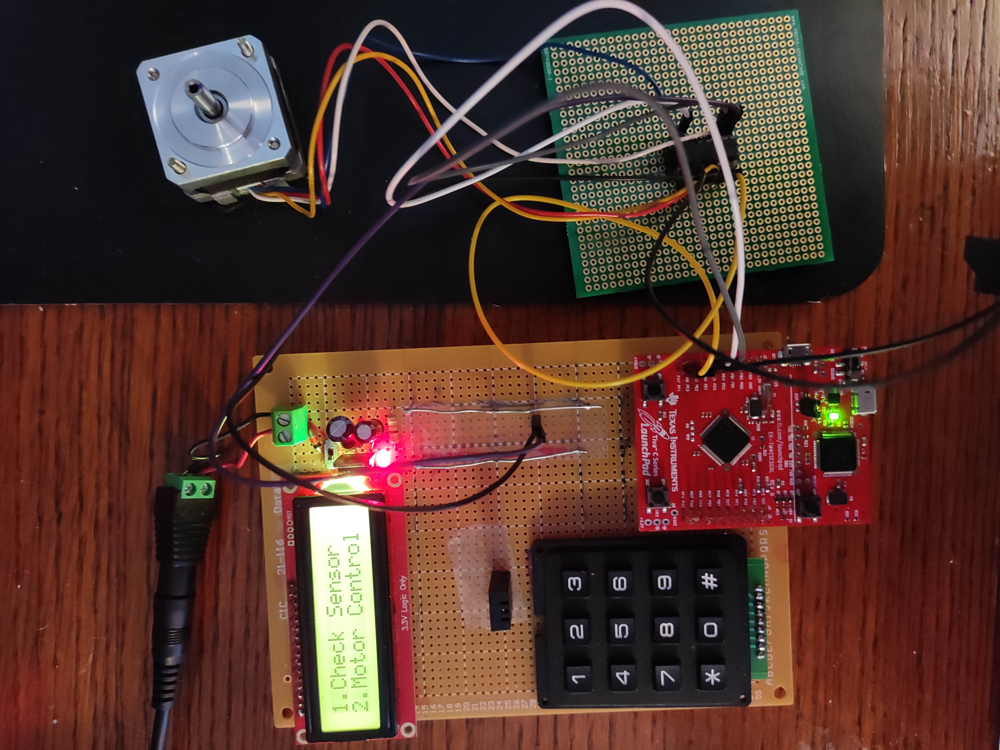
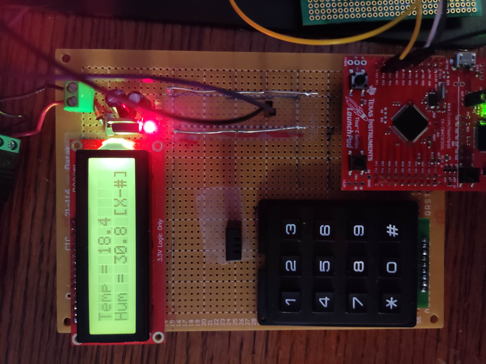

# Weather-Station

Weather station created with the TIVA TM4C123G
Project built with CCS

The tm4c123ge6pm.h header can be sourced from the TivaWare tools

To build your own weather station you will need a SparkFun 16x2 SerLCD (LCD-16396), Keypad - 12 Button, DHT20, Stepper Motor (KP35FM2-035), L293DNE, ~9-12V Power Source, and a 5V regulator.

The output of the 5V regulator powers the LCD and the TIVA EVB. ~9-12V to power the L293DNE/Stepper Motor. The 3.3V regulator on the TM4C123G is used for the DHT20.

DHT20 connects to Port A, Keypad connects to Port B, LCD connects to Port D, and the L293DNE connects to Port E. 
